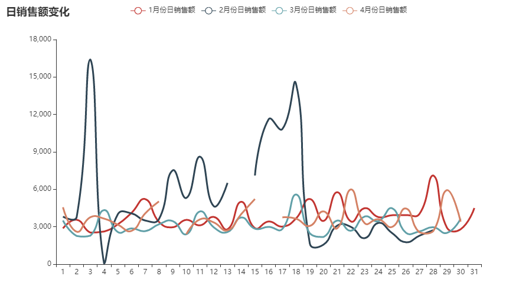
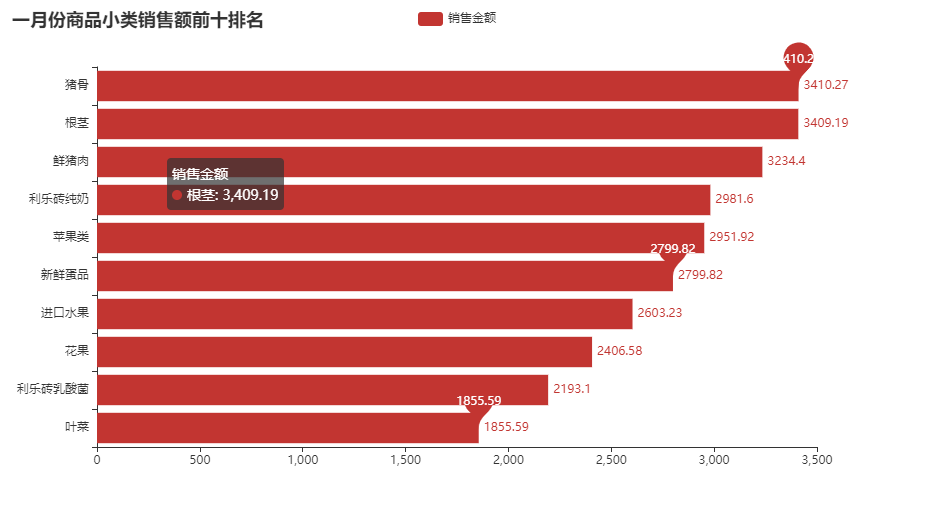

# WarehouseCategorization
#### 超市销售数据分析及基于kmeans的客户聚类

在独臂盘点侠的盘点系统中我们对超市销售数据进行了具体分析并且基于k-means 算法进行了客户聚类。

##### 一、导入数据，查看数据基本情况

```
# 导入各种包
import pandas as pd
import numpy as np
import seaborn as sns
import matplotlib.pyplot as plt
from datetime import datetime
from pyecharts.charts import Line,Bar,Pie
import pyecharts.options as opts
import time
from sklearn.cluster import KMeans
from sklearn.preprocessing import MinMaxScaler
from sklearn.metrics import silhouette_score

# 导入数据、查看数据
path = "./超市销售数据.csv"
df = pd.read_csv(path,encoding = 'gbk')
print(df.shape)
print(df.info())
df.head()
```

##### 二、数据处理（缺失值、异常值）

###### 处理数据中的日期

```
# 销售日期转化为datetime，提取月、日
# 2015年没有2月29日，所以删除2月29日的两条数据
df.drop(df[df['销售日期'] == 20150229].index.tolist(),inplace = True)
# 将销售日期转换为datatime格式
df['销售日期'] = pd.to_datetime(df['销售日期'].astype(str),format = '%Y-%m-%d')
df.head()
# 提取日期中的周
df['销售周'] = df['销售日期'].dt.week
# 提取日期中的日
df['销售日'] = df['销售日期'].dt.day
```

###### 缺失值的处理

# 删除缺失值
```
# 查看缺失的数据有哪些
df.isnull().sum()
df[df['销售数量'].isnull()]

# 销售数量有两个缺失值，删除缺失值
df.dropna(subset = ['销售数量'],inplace = True)
df.isnull().sum()
```


###### 异常值的处理

```
# 查看异常值以及去除异常值
# 销售数量有88条小于0的数据，初步判断可能是由于退货以及销售人员的操作失误导致的
print('销售金额为负数的数量为：'+str(df[df['销售数量'] <= 0].shape[0]))
df[df['销售数量'] <= 0].head()
# 销售金额有93条小于等于0的数据，初步判断可能是由于退货以及销售人员的操作失误导致的
print(df[df['销售金额'] <= 0].shape)
df[df['销售金额'] <= 0].head(2)
# 销售单价只有2条等于0的数据，应该是业务人员误操作导致,直接进行删除
df[df['商品单价'] <= 0]
# 如果是退货的话，销售金额为负，而销售金额等于0的数据应该为收银员的误操作，进行删除
df[df['销售金额'] == 0]
# 删除商品单价和销售金额为0的数据
df.drop(index = df[df['商品单价']==0].index,axis = 0,inplace = True)
df.drop(index = df[df['销售金额'] == 0].index,axis = 0,inplace = True)
# 加一个字段，判断是否退货，将销售金额小于0的数据标记为退货
df['是否退货'] = 0
df.loc[df[df['销售金额'] < 0].index,'是否退货'] = 1
df[df['销售金额'] < 0].head()
# 因为存在单价*数量不等于销售金额的情况，如下
print('单价*销量 != 销售额的数据有:',df[(df['商品单价'] * df['销售数量']) != df['销售金额']].shape[0])
df[(df['商品单价'] * df['销售数量']) != df['销售金额']].head()
# 因为存在单价*数量不等于销售金额的情况，如下
print('单价*销量 != 销售额的数据有:',df[(df['商品单价'] * df['销售数量']) != df['销售金额']].shape[0])
df[(df['商品单价'] * df['销售数量']) != df['销售金额']].head()
```


###### 去掉不会用到的字段

```
col_lis = ['大类编码','中类编码','小类编码','商品编码']
for i in col_lis:
    del df[i]
df.head()
```


##### 三、对销售数据进行统计分析

###### 按时间序列统计销售额的变化

```
# 统计每个月的销售总额变化（可视化展示）
month_money_sum = df.groupby('销售月份')['销售金额'].sum().round(2)
line = (
    Line()
    .add_xaxis(xaxis_data = month_money_sum.index.astype(str).tolist())
    .add_yaxis(
        series_name = '月销售总额',
        y_axis = month_money_sum.values.tolist())
    .set_global_opts(title_opts = opts.TitleOpts(title = '平均日销售额变化'))
)
line.render("01平均日销售额变化.html")
```


可以发现，月销售总额中，2015年2月份的销售总额最高，在3月份迎来一个比较大的下滑，且在4月份的销售额进行了部分回升。
月销售总额在9.5万-14万之间

###### 按类别统计销售额的变化

```
# 统计每个月的日平均销售额变化（可视化展示）
day_money_sum = pd.pivot_table(df,values = '销售金额',index = '销售月份',columns = '销售日',aggfunc = 'sum')
month_money_avg = day_money_sum.loc[:,1:].mean().round(2)
line = (
    Line()
    .add_xaxis(xaxis_data = month_money_avg.index.astype(str).tolist())
    .add_yaxis(
        series_name = '平均日销售额',
        y_axis = month_money_avg.values.tolist(),
        markpoint_opts=opts.MarkPointOpts(    # 标记点配置项
        data=[
                opts.MarkPointItem(type_="max", name="最大值"),
                opts.MarkPointItem(type_="min", name="最小值"),
                opts.MarkPointItem(type_="average", name="平均值")
            ]
            )
        )
    .set_global_opts(title_opts = opts.TitleOpts(title = '平均日销售额变化'))
    )
line.render("02平均日销售额变化.html")
```


在平均日销售额的变化图中，我们可以发现，平均每个月的18号销售额最多，3号次之，销售额会在月初和月中呈现一个较大的波动，其他时间段的销售额都较为平缓。
但是由于数据中月份较少，且2月份由于受到新年的影响，销售额本身较高，可能会拉高整体的水平，所以我们还要看一下每个月每天的销售额数据。

```
# 一月份平均每天的销售额变化
month1_money = day_money_sum.iloc[0, :].round(0)
month2_money = day_money_sum.iloc[1, :].round(0)
month3_money = day_money_sum.iloc[2, :].round(0)
month4_money = day_money_sum.iloc[3, :].round(0)
line = (
    Line()
        .add_xaxis(xaxis_data=month1_money.index.astype(str).tolist())
        .add_yaxis(
        series_name='1月份日销售额',
        y_axis=month1_money.values.tolist(),
        is_smooth=True,
        is_symbol_show=False,
        linestyle_opts=opts.LineStyleOpts(width=3)
    )

        .add_yaxis(
        series_name='2月份日销售额',
        y_axis=month2_money.values.tolist(),
        is_smooth=True,
        is_symbol_show=False,
        linestyle_opts=opts.LineStyleOpts(width=3)
    )
    
        .add_yaxis(
        series_name='3月份日销售额',
        y_axis=month3_money.values.tolist(),
        is_smooth=True,
        is_symbol_show=False,
        linestyle_opts=opts.LineStyleOpts(width=3)
    )


        .add_yaxis(
        series_name='4月份日销售额',
        y_axis=month4_money.values.tolist(),
        is_smooth=True,
        is_symbol_show=False,
        linestyle_opts=opts.LineStyleOpts(width=3)
    )
    
        .set_global_opts(title_opts=opts.TitleOpts(title='日销售额变化'))

)
line.render("03日销售额变化.html")
```



```
# 去掉2月份的数据，查看1,3,4月的平均日销售额的变化趋势

month_money_avg2 = day_money_sum.iloc[[0,2,3],:].mean().round(0)
line = (
    Line()
    .add_xaxis(xaxis_data = month_money_avg2.index.astype(str).tolist())
    .add_yaxis(
        series_name = '平均日销售额',
        y_axis = month_money_avg2.values.tolist(),
        markpoint_opts=opts.MarkPointOpts(    # 标记点配置项
        data=[
                opts.MarkPointItem(type_="max", name="最大值"),
                opts.MarkPointItem(type_="min", name="最小值"),
                opts.MarkPointItem(type_="average", name="平均值")
            ]
            )
        )
    .set_global_opts(title_opts = opts.TitleOpts(title = '平均日销售额变化'))
    )
line.render("04平均日销售额变化.html")
```


```
# 统计每个周的周销售总额变化（和所有周销售总额均值对比）

week_money_sum = df.groupby('销售周')['销售金额'].sum().round(0).reset_index().\
sort_values(by = '销售周',ascending = True)
line = (
    Line()
    .add_xaxis(xaxis_data = week_money_sum['销售周'].tolist())
    .add_yaxis(
        series_name = '周销售额',
        y_axis = week_money_sum['销售金额'].tolist(),
        markpoint_opts=opts.MarkPointOpts(    # 标记点配置项
        data=[
                opts.MarkPointItem(type_="max", name="最大值"),
                opts.MarkPointItem(type_="min", name="最小值"),
                opts.MarkPointItem(type_="average", name="平均值")
            ]
            )
        )
    .set_global_opts(title_opts = opts.TitleOpts(title = '周销售额变化'))
    )
line.render("05周销售额变化.html")
```


## 按类别统计销售额的变化

```
# 统计所有商品类型的销售额

type_money = df.groupby('商品类型')['销售金额'].sum().round(2)
pie = (
    Pie()
    .add(
        "",
        [list(i) for i in zip(type_money.index.tolist(),type_money.values.tolist())],
    )
    .set_global_opts(
        title_opts=opts.TitleOpts(title="商品类型销售额占比"),
    )
)
pie.render("06商品类型销售额占比.html")
```


通过绘制商品类型销售额占比饼图我们可以发现，一般商品的销售额占比最大，其次是生鲜，联营类型商品占比最小

```
# 统计大类名称的销售额（排名）

type_money = df.groupby('大类名称')['销售金额'].sum().round(2).sort_values(ascending = False)
bar = (
    Bar()
    .add_xaxis(type_money.index.tolist())
    .add_yaxis(
        '销售金额',
        type_money.values.tolist(),
        markpoint_opts=opts.MarkPointOpts(    # 标记点配置项
        data=[
            opts.MarkPointItem(type_="max", name="最大值"),
            opts.MarkPointItem(type_="min", name="最小值"),
            opts.MarkPointItem(type_="average", name="平均值")
        ]
        )
        )
    .set_global_opts(
        title_opts=opts.TitleOpts(title="商品大类销售额排名"),
    )
)
bar.render("07商品大类销售额排名.html")
```


可以发现，在商品大类的销售额对比中，日配的销售额是最高的，其次是蔬果、休闲、粮油等

```
# 统计中类名称的销售额（排名）

type_money = df.groupby('中类名称')['销售金额'].sum().round(2).sort_values(ascending = False).iloc[:10]
type_money
bar = (
    Bar()
    .add_xaxis(type_money.index.tolist())
    .add_yaxis(
        '销售金额',
        type_money.values.tolist(),
        markpoint_opts=opts.MarkPointOpts(    # 标记点配置项
        data=[
            opts.MarkPointItem(type_="max", name="最大值"),
            opts.MarkPointItem(type_="min", name="最小值"),
            opts.MarkPointItem(type_="average", name="平均值")
        ]
        )
        )
    .set_global_opts(
        title_opts=opts.TitleOpts(title="商品中类销售额前十排名"),
    )
)
bar.render("08商品中类销售额前十排名.html")
```


由于中类类型较多，所以取中类前十名的销售额进行展示。可以发现中类中，水果、常温乳品、蔬菜等销售额较高

```
# 统计小类名称的销售额（排名）

type_money = df.groupby('小类名称')['销售金额'].sum().round(2).sort_values(ascending = False).iloc[:10]
type_money
bar = (
    Bar()
    .add_xaxis(type_money.index.tolist())
    .add_yaxis(
        '销售金额',
        type_money.values.tolist(),
        markpoint_opts=opts.MarkPointOpts(    # 标记点配置项
        data=[
            opts.MarkPointItem(type_="max", name="最大值"),
            opts.MarkPointItem(type_="min", name="最小值"),
            opts.MarkPointItem(type_="average", name="平均值")
        ]
        )
        )
    .set_global_opts(
        title_opts=opts.TitleOpts(title="商品小类销售额前十排名"),
    )
)
bar.render("09商品小类销售额前十排名.html")
```


```
# 统计一月销售额排名前十的小类

money_rank = df[df['销售月份'] == 201501].groupby('小类名称')['销售金额'].sum().round(2).\
sort_values(ascending = False).reset_index().iloc[:10].sort_values(by = '销售金额')
bar = (
    Bar()
    .add_xaxis(money_rank['小类名称'].tolist())
    .add_yaxis(
        '销售金额',
        money_rank['销售金额'].tolist(),
        markpoint_opts=opts.MarkPointOpts(    # 标记点配置项
        data=[
            opts.MarkPointItem(type_="max", name="最大值"),
            opts.MarkPointItem(type_="min", name="最小值"),
            opts.MarkPointItem(type_="average", name="平均值")
        ]
        )
        )
    .reversal_axis()
    .set_series_opts(label_opts = opts.LabelOpts(position = 'right'))
    .set_global_opts(
        title_opts=opts.TitleOpts(title="一月份商品小类销售额前十排名"),
    )
    )
bar.render("10一月份商品小类销售额前十排名.html")
```




```
# 统计二月销售额排名前十的小类

money_rank = df[df['销售月份'] == 201502].groupby('小类名称')['销售金额'].sum().round(2).\
sort_values(ascending = False).reset_index().iloc[:10].sort_values(by = '销售金额')
bar = (
    Bar()
    .add_xaxis(money_rank['小类名称'].tolist())
    .add_yaxis(
        '销售金额',
        money_rank['销售金额'].tolist(),
        markpoint_opts=opts.MarkPointOpts(    # 标记点配置项
        data=[
            opts.MarkPointItem(type_="max", name="最大值"),
            opts.MarkPointItem(type_="min", name="最小值"),
            opts.MarkPointItem(type_="average", name="平均值")
        ]
        )
        )
    .reversal_axis()
    .set_series_opts(label_opts = opts.LabelOpts(position = 'right'))
    .set_global_opts(
        title_opts=opts.TitleOpts(title="二月份商品小类销售额前十排名"),
    )
    )
bar.render("11二月份商品小类销售额前十排名.html")
```


```
# 统计三月销售额排名前十的小类

money_rank = df[df['销售月份'] == 201503].groupby('小类名称')['销售金额'].sum().round(2).\
sort_values(ascending = False).reset_index().iloc[:10].sort_values(by = '销售金额')
bar = (
    Bar()
    .add_xaxis(money_rank['小类名称'].tolist())
    .add_yaxis(
        '销售金额',
        money_rank['销售金额'].tolist(),
        markpoint_opts=opts.MarkPointOpts(    # 标记点配置项
        data=[
            opts.MarkPointItem(type_="max", name="最大值"),
            opts.MarkPointItem(type_="min", name="最小值"),
            opts.MarkPointItem(type_="average", name="平均值")
        ]
        )
        )
    .reversal_axis()
    .set_series_opts(label_opts = opts.LabelOpts(position = 'right'))
    .set_global_opts(
        title_opts=opts.TitleOpts(title="三月份商品小类销售额前十排名"),
    )
    )
bar.render("12三月份商品小类销售额前十排名.html")
```


```
# 统计四月销售额排名前十的小类

money_rank = df[df['销售月份'] == 201504].groupby('小类名称')['销售金额'].sum().round(2).\
sort_values(ascending = False).reset_index().iloc[:10].sort_values(by = '销售金额')
bar = (
    Bar()
    .add_xaxis(money_rank['小类名称'].tolist())
    .add_yaxis(
        '销售金额',
        money_rank['销售金额'].tolist(),
        markpoint_opts=opts.MarkPointOpts(    # 标记点配置项
        data=[
            opts.MarkPointItem(type_="max", name="最大值"),
            opts.MarkPointItem(type_="min", name="最小值"),
            opts.MarkPointItem(type_="average", name="平均值")
        ]
        )
        )
    .reversal_axis()
    .set_series_opts(label_opts = opts.LabelOpts(position = 'right'))
    .set_global_opts(
        title_opts=opts.TitleOpts(title="四月份商品小类销售额前十排名"),
    )
    )
bar.render("13四月份商品小类销售额前十排名.html")
```


通过观察三、四月份的销量情况，不难发现，三四月份的销量较高的产品都差不多，基本都是水果、根茎、单品、香烟等日常消费产品。

综合上述分析，我们给出超市如下建议。
1、过年期间对于烟酒等产品的销量较高，可以在临近过年期间增加烟酒的库存，搞点促销活动，进一步加大烟酒的销售额。
2、平时消费者对于根茎、猪肉、水果这一类产品的消费需求较高，可以在平时对猪肉水果等产品进行一些促销活动，增加这些日常消费产品的销量，吸引更多消费者来消费日常用品，增加消费者的黏性。

##### 四、对用户数据进行统计分析

###### 根据现有数据计算生成顾客行为表

## 根据现有数据计算生成顾客行为表


```
# 根据顾客编号进行分组，计算顾客的购买次数、购买总金额、购买各类型商品的金额、客单价，生成一张顾客行为的dataframe
# 查看总计有多少顾客来超市买过东西
print('总计有',df['顾客编号'].nunique(),'名顾客来超市购买过商品.')
总计有 2612 名顾客来超市购买过商品.
```


|      | 顾客编号 | 大类名称 | 中类名称 |     小类名称 |   销售日期 | 销售月份 | 规格型号 | 商品类型 | 单位 | 销售数量 | 销售金额 | 商品单价 | 是否促销 | 销售周 | 销售日 | 是否退货 | 实际销售价格 |
| :--- | -------: | -------: | -------: | -----------: | ---------: | -------: | -------: | -------: | ---: | -------: | -------: | -------: | -------: | -----: | -----: | -------: | -----------: |
| 0    |        0 |     蔬果 |     蔬菜 |     其它蔬菜 | 2015-01-01 |   201501 |          |     生鲜 |   个 |      8.0 |      4.0 |      2.0 |       否 |      1 |      1 |        0 |          0.5 |
| 1    |        1 |     粮油 |   酱菜类 |         榨菜 | 2015-01-01 |   201501 |      60g | 一般商品 |   袋 |      6.0 |      3.0 |      0.5 |       否 |      1 |      1 |        0 |          0.5 |
| 2    |        2 |     日配 | 冷藏乳品 | 冷藏加味酸乳 | 2015-01-01 |   201501 |     150g | 一般商品 |   袋 |      1.0 |      2.4 |      2.4 |       否 |      1 |      1 |        0 |          2.4 |
| 3    |        3 |     日配 | 冷藏料理 |   冷藏面食类 | 2015-01-01 |   201501 |     500g | 一般商品 |   袋 |      1.0 |      6.5 |      8.3 |       否 |      1 |      1 |        0 |          6.5 |
| 4    |        4 |     日配 | 冷藏乳品 | 冷藏加味酸乳 | 2015-01-01 |   201501 |   100g*8 | 一般商品 |   袋 |      1.0 |     11.9 |     11.9 |       否 |      1 |      1 |        0 |         11.9 |


```
# 1.计算客户购买次数
# 注：这里直接用count计数的话是不合理的，因为一个客户可能一天内买过七八种商品，但实际上他的购买次数却只有这一次
df.groupby('顾客编号')['销售日期'].count().head()
```


```
顾客编号
0     5
1     7
2    22
3    52
4    18
Name: 销售日期, dtype: int64
```


```
# 例如顾客编号为0的这名顾客，他在2015-01-01购买了四种商品，在2015-04-25购买了一种商品，其实他只在这个超市购买过两次，应该算作两次的购买次数的。
df[df['顾客编号'] == 0]
```


|       | 顾客编号 | 大类名称 |     中类名称 | 小类名称 |   销售日期 | 销售月份 | 规格型号 | 商品类型 | 单位 | 销售数量 | 销售金额 | 商品单价 | 是否促销 | 销售周 | 销售日 | 是否退货 | 实际销售价格 |
| :---- | -------: | -------: | -----------: | -------: | ---------: | -------: | -------: | -------: | ---: | -------: | -------: | -------: | -------: | -----: | -----: | -------: | -----------: |
| 0     |        0 |     蔬果 |         蔬菜 | 其它蔬菜 | 2015-01-01 |   201501 |          |     生鲜 |   个 |    8.000 |     4.00 |     2.00 |       否 |      1 |      1 |        0 |     0.500000 |
| 165   |        0 |     蔬果 |         蔬菜 |     花果 | 2015-01-01 |   201501 |     散称 |     生鲜 | 千克 |    0.830 |     1.64 |     1.98 |       否 |      1 |      1 |        0 |     1.975904 |
| 178   |        0 |     熟食 | 现制中式面点 | 现制蒸类 | 2015-01-01 |   201501 |       个 |     生鲜 |   个 |    4.000 |     2.00 |     0.50 |       否 |      1 |      1 |        0 |     0.500000 |
| 180   |        0 |     蔬果 |         蔬菜 |     花果 | 2015-01-01 |   201501 |     散称 |     生鲜 | 千克 |    1.078 |     3.41 |     3.16 |       否 |      1 |      1 |        0 |     3.163265 |
| 40764 |        0 |     粮油 |     五谷杂粮 | 散称白米 | 2015-04-25 |   201504 |     散称 | 一般商品 | 千克 |    3.237 |    13.60 |     4.20 |       否 |     17 |     25 |        0 |     4.201421 |


```
# 所以我们这里统计次数的时候要去重一下，使用nunique()，这样统计出来的0号顾客购买次数是2就没问题了
consume_counts = df.groupby('顾客编号')['销售日期'].nunique().reset_index().rename(columns = {'销售日期':'消费次数'})
consume_counts.head()
```


|      | 顾客编号 | 消费次数 |
| :--- | -------: | -------: |
| 0    |        0 |        2 |
| 1    |        1 |        2 |
| 2    |        2 |        3 |
| 3    |        3 |       18 |
| 4    |        4 |        3 |


```
# 2.计算客户购买总金额
consume_money = df.groupby('顾客编号')['销售金额'].sum().reset_index().rename(columns = {'销售金额':'消费总金额'})
consume_money.head()
```


|      | 顾客编号 | 消费总金额 |
| :--- | -------: | ---------: |
| 0    |        0 |      24.65 |
| 1    |        1 |      42.60 |
| 2    |        2 |      78.70 |
| 3    |        3 |     546.51 |
| 4    |        4 |     182.84 |


```
# 3.计算客户购买各大类商品的金额
consume_type = pd.pivot_table(df,index = '顾客编号',columns = '大类名称',values = '销售金额',aggfunc = np.sum)
consume_type = consume_type.fillna(0).reset_index()
consume_type.head()
```


| 大类名称 | 顾客编号 |  休闲 | 冲调 | 家居 | 家电 | 文体 |  日配 | 水产 | 洗化 | 烘焙 |  熟食 |  粮油 |  肉禽 |  蔬果 |  酒饮 | 针织 |
| :------- | -------: | ----: | ---: | ---: | ---: | ---: | ----: | ---: | ---: | ---: | ----: | ----: | ----: | ----: | ----: | ---: |
| 0        |        0 |  0.00 |  0.0 |  0.0 |  0.0 |  0.0 |  0.00 | 0.00 |  0.0 |  0.0 |  2.00 | 13.60 |  0.00 |  9.05 |   0.0 |  0.0 |
| 1        |        1 | 16.80 |  0.0 | 13.5 |  0.0 |  0.0 |  0.00 | 0.00 |  0.0 |  0.0 |  0.00 |  8.70 |  0.00 |  3.60 |   0.0 |  0.0 |
| 2        |        2 | 23.01 |  0.0 |  0.0 |  0.0 |  0.0 | 12.20 | 0.00 |  0.0 |  0.0 |  1.52 |  0.00 |  0.00 | 41.97 |   0.0 |  0.0 |
| 3        |        3 | 57.83 |  0.0 |  0.0 |  0.0 |  0.0 | 34.47 | 7.92 |  0.0 |  0.0 | 12.79 | 66.65 | 27.52 | 79.33 | 260.0 |  0.0 |
| 4        |        4 |  0.00 |  0.0 |  0.0 |  0.0 |  0.0 | 36.18 | 0.00 | 34.2 |  0.0 |  0.00 |  0.00 | 19.97 | 83.69 |   8.8 |  0.0 |


```
# 4.计算每个客户平均单次购买金额
# 先将上边的三个表连接起来
consume = pd.concat([consume_counts,consume_money,consume_type],axis = 1)
consume.head()
```


|      | 顾客编号 | 消费次数 | 顾客编号 | 消费总金额 | 顾客编号 |  休闲 | 冲调 | 家居 | 家电 | 文体 |  日配 | 水产 | 洗化 | 烘焙 |  熟食 |  粮油 |  肉禽 |  蔬果 |  酒饮 | 针织 |
| :--- | -------: | -------: | -------: | ---------: | -------: | ----: | ---: | ---: | ---: | ---: | ----: | ---: | ---: | ---: | ----: | ----: | ----: | ----: | ----: | ---: |
| 0    |        0 |        2 |        0 |      24.65 |        0 |  0.00 |  0.0 |  0.0 |  0.0 |  0.0 |  0.00 | 0.00 |  0.0 |  0.0 |  2.00 | 13.60 |  0.00 |  9.05 |   0.0 |  0.0 |
| 1    |        1 |        2 |        1 |      42.60 |        1 | 16.80 |  0.0 | 13.5 |  0.0 |  0.0 |  0.00 | 0.00 |  0.0 |  0.0 |  0.00 |  8.70 |  0.00 |  3.60 |   0.0 |  0.0 |
| 2    |        2 |        3 |        2 |      78.70 |        2 | 23.01 |  0.0 |  0.0 |  0.0 |  0.0 | 12.20 | 0.00 |  0.0 |  0.0 |  1.52 |  0.00 |  0.00 | 41.97 |   0.0 |  0.0 |
| 3    |        3 |       18 |        3 |     546.51 |        3 | 57.83 |  0.0 |  0.0 |  0.0 |  0.0 | 34.47 | 7.92 |  0.0 |  0.0 | 12.79 | 66.65 | 27.52 | 79.33 | 260.0 |  0.0 |
| 4    |        4 |        3 |        4 |     182.84 |        4 |  0.00 |  0.0 |  0.0 |  0.0 |  0.0 | 36.18 | 0.00 | 34.2 |  0.0 |  0.00 |  0.00 | 19.97 | 83.69 |   8.8 |  0.0 |


```
# 将数据拼接好后，我发现有三个顾客编号字段，关于如何去掉这三个重复的字段，我也是想了很久，直接del和drop都不太可行，会把三个字段都删掉
# 索引出来没有重复字段的所有列也不太好操作，于是我求助了群里的小伙伴，他们给出了如下解决方案
# 直接取反进行字段名的去重
consume = consume.loc[:,~consume.columns.duplicated()]
consume.head()
```


|      | 顾客编号 | 消费次数 | 消费总金额 |  休闲 | 冲调 | 家居 | 家电 | 文体 |  日配 | 水产 | 洗化 | 烘焙 |  熟食 |  粮油 |  肉禽 |  蔬果 |  酒饮 | 针织 |
| :--- | -------: | -------: | ---------: | ----: | ---: | ---: | ---: | ---: | ----: | ---: | ---: | ---: | ----: | ----: | ----: | ----: | ----: | ---: |
| 0    |        0 |        2 |      24.65 |  0.00 |  0.0 |  0.0 |  0.0 |  0.0 |  0.00 | 0.00 |  0.0 |  0.0 |  2.00 | 13.60 |  0.00 |  9.05 |   0.0 |  0.0 |
| 1    |        1 |        2 |      42.60 | 16.80 |  0.0 | 13.5 |  0.0 |  0.0 |  0.00 | 0.00 |  0.0 |  0.0 |  0.00 |  8.70 |  0.00 |  3.60 |   0.0 |  0.0 |
| 2    |        2 |        3 |      78.70 | 23.01 |  0.0 |  0.0 |  0.0 |  0.0 | 12.20 | 0.00 |  0.0 |  0.0 |  1.52 |  0.00 |  0.00 | 41.97 |   0.0 |  0.0 |
| 3    |        3 |       18 |     546.51 | 57.83 |  0.0 |  0.0 |  0.0 |  0.0 | 34.47 | 7.92 |  0.0 |  0.0 | 12.79 | 66.65 | 27.52 | 79.33 | 260.0 |  0.0 |
| 4    |        4 |        3 |     182.84 |  0.00 |  0.0 |  0.0 |  0.0 |  0.0 | 36.18 | 0.00 | 34.2 |  0.0 |  0.00 |  0.00 | 19.97 | 83.69 |   8.8 |  0.0 |


```
# 我想到的就是改成用merge连接，比较笨的方法，要是有十来张表，人就傻了
consume = pd.merge(pd.merge(consume_counts,consume_money,how = 'outer',on = '顾客编号'),consume_type,how = 'outer',on = '顾客编号')
consume.head()
```


|      | 顾客编号 | 消费次数 | 消费总金额 |  休闲 | 冲调 | 家居 | 家电 | 文体 |  日配 | 水产 | 洗化 | 烘焙 |  熟食 |  粮油 |  肉禽 |  蔬果 |  酒饮 | 针织 |
| :--- | -------: | -------: | ---------: | ----: | ---: | ---: | ---: | ---: | ----: | ---: | ---: | ---: | ----: | ----: | ----: | ----: | ----: | ---: |
| 0    |        0 |        2 |      24.65 |  0.00 |  0.0 |  0.0 |  0.0 |  0.0 |  0.00 | 0.00 |  0.0 |  0.0 |  2.00 | 13.60 |  0.00 |  9.05 |   0.0 |  0.0 |
| 1    |        1 |        2 |      42.60 | 16.80 |  0.0 | 13.5 |  0.0 |  0.0 |  0.00 | 0.00 |  0.0 |  0.0 |  0.00 |  8.70 |  0.00 |  3.60 |   0.0 |  0.0 |
| 2    |        2 |        3 |      78.70 | 23.01 |  0.0 |  0.0 |  0.0 |  0.0 | 12.20 | 0.00 |  0.0 |  0.0 |  1.52 |  0.00 |  0.00 | 41.97 |   0.0 |  0.0 |
| 3    |        3 |       18 |     546.51 | 57.83 |  0.0 |  0.0 |  0.0 |  0.0 | 34.47 | 7.92 |  0.0 |  0.0 | 12.79 | 66.65 | 27.52 | 79.33 | 260.0 |  0.0 |
| 4    |        4 |        3 |     182.84 |  0.00 |  0.0 |  0.0 |  0.0 |  0.0 | 36.18 | 0.00 | 34.2 |  0.0 |  0.00 |  0.00 | 19.97 | 83.69 |   8.8 |  0.0 |


```
# 下边来计算每个客户平均单次购买金额
consume['平均单次购买金额'] = consume['消费总金额'] / consume['消费次数']
consume['平均单次购买金额'] = consume['平均单次购买金额'].round(2)
consume.head()
```


|      | 顾客编号 | 消费次数 | 消费总金额 |  休闲 | 冲调 | 家居 | 家电 | 文体 |  日配 | 水产 | 洗化 | 烘焙 |  熟食 |  粮油 |  肉禽 |  蔬果 |  酒饮 | 针织 | 平均单次购买金额 |
| :--- | -------: | -------: | ---------: | ----: | ---: | ---: | ---: | ---: | ----: | ---: | ---: | ---: | ----: | ----: | ----: | ----: | ----: | ---: | ---------------: |
| 0    |        0 |        2 |      24.65 |  0.00 |  0.0 |  0.0 |  0.0 |  0.0 |  0.00 | 0.00 |  0.0 |  0.0 |  2.00 | 13.60 |  0.00 |  9.05 |   0.0 |  0.0 |            12.32 |
| 1    |        1 |        2 |      42.60 | 16.80 |  0.0 | 13.5 |  0.0 |  0.0 |  0.00 | 0.00 |  0.0 |  0.0 |  0.00 |  8.70 |  0.00 |  3.60 |   0.0 |  0.0 |            21.30 |
| 2    |        2 |        3 |      78.70 | 23.01 |  0.0 |  0.0 |  0.0 |  0.0 | 12.20 | 0.00 |  0.0 |  0.0 |  1.52 |  0.00 |  0.00 | 41.97 |   0.0 |  0.0 |            26.23 |
| 3    |        3 |       18 |     546.51 | 57.83 |  0.0 |  0.0 |  0.0 |  0.0 | 34.47 | 7.92 |  0.0 |  0.0 | 12.79 | 66.65 | 27.52 | 79.33 | 260.0 |  0.0 |            30.36 |
| 4    |        4 |        3 |     182.84 |  0.00 |  0.0 |  0.0 |  0.0 |  0.0 | 36.18 | 0.00 | 34.2 |  0.0 |  0.00 |  0.00 | 19.97 | 83.69 |   8.8 |  0.0 |            60.95 |

## 统计分析顾客购买行为表


```
# 现在已经生成了顾客购买行为表，下边来进行一下统计分析
# 1. 购买次数前10的顾客
consume[['顾客编号','消费次数']].sort_values(by = '消费次数',ascending = False).iloc[:10,:]
```


|      | 顾客编号 | 消费次数 |
| :--- | -------: | -------: |
| 210  |      210 |       52 |
| 52   |       52 |       51 |
| 81   |       81 |       47 |
| 47   |       47 |       45 |
| 12   |       12 |       45 |
| 51   |       51 |       38 |
| 24   |       24 |       37 |
| 304  |      304 |       35 |
| 92   |       92 |       32 |
| 372  |      372 |       32 |

可以发现，这10名顾客的购买次数最多，说明其经常来该超市消费


```
# 2. 消费金额前十的顾客
consume[['顾客编号','消费总金额']].sort_values(by = '消费总金额',ascending = False).iloc[:10,:]
```


|      | 顾客编号 | 消费总金额 |
| :--- | -------: | ---------: |
| 1177 |     1177 |   13597.06 |
| 52   |       52 |    3589.15 |
| 986  |      986 |    2611.24 |
| 1385 |     1385 |    2451.50 |
| 108  |      108 |    2340.32 |
| 210  |      210 |    1989.73 |
| 12   |       12 |    1838.19 |
| 395  |      395 |    1820.20 |
| 74   |       74 |    1660.37 |
| 1594 |     1594 |    1563.90 |

可以发现，消费金额高的和消费次数高的并不完全是同一批人，所以我们还要在查看平均单次消费金额较高的顾客


```
# 3. 平均单次消费金额前十的顾客
consume[['顾客编号','平均单次购买金额']].sort_values(by = '平均单次购买金额',ascending = False).iloc[:10,:]
```


|      | 顾客编号 | 平均单次购买金额 |
| :--- | -------: | ---------------: |
| 1385 |     1385 |          2451.50 |
| 1594 |     1594 |          1563.90 |
| 1177 |     1177 |          1510.78 |
| 2317 |     2317 |           880.00 |
| 1541 |     1541 |           745.90 |
| 1093 |     1093 |           621.99 |
| 1614 |     1614 |           617.70 |
| 1448 |     1448 |           491.40 |
| 841  |      841 |           458.22 |
| 1566 |     1566 |           404.70 |

光知道哪些客户消费金额高、消费次数高显然是不够的，我们还要交叉分析一下，知道消费金额高的客户购买哪些类型的商品多，消费次数较高的客户购买哪些类型的商品多

```
# 消费次数前十的顾客都会购买哪种商品

count_consume = consume.sort_values(by='消费次数', ascending=False).iloc[:10, 3:18].sum(). \
    round(2).sort_values(ascending=True)

bar = (
    Bar()
        .add_xaxis(count_consume.index.tolist())
        .add_yaxis(
        '销售金额',
        count_consume.values.tolist(),
        markpoint_opts=opts.MarkPointOpts(  # 标记点配置项
            data=[
                opts.MarkPointItem(type_="max", name="最大值"),
                opts.MarkPointItem(type_="min", name="最小值"),
                opts.MarkPointItem(type_="average", name="平均值")
            ]
        )
    )
        .reversal_axis()
        .set_series_opts(label_opts=opts.LabelOpts(position='right'))
        .set_global_opts(
        title_opts=opts.TitleOpts(title="消费次数前十的顾客购买商品排名"),
    )
)
bar.render("14消费次数前十的顾客购买商品排名.html")
```


我们发现，消费次数前十的顾客，购买蔬果、休闲、粮油、日配的商品较多，这些商品作为日常用品，是会吸引消费者频繁去进行消费

```
# 消费消费总金额前十的顾客都会购买哪种商品

count_consume = consume.sort_values(by='消费总金额', ascending=False).iloc[:10, 3:18].sum(). \
    round(2).sort_values(ascending=True)

bar = (
    Bar()
        .add_xaxis(count_consume.index.tolist())
        .add_yaxis(
        '销售金额',
        count_consume.values.tolist(),
        markpoint_opts=opts.MarkPointOpts(  # 标记点配置项
            data=[
                opts.MarkPointItem(type_="max", name="最大值"),
                opts.MarkPointItem(type_="min", name="最小值"),
                opts.MarkPointItem(type_="average", name="平均值")
            ]
        )
    )
        .reversal_axis()
        .set_series_opts(label_opts=opts.LabelOpts(position='right'))
        .set_global_opts(
        title_opts=opts.TitleOpts(title="消费总金额前十的顾客购买商品排名"),
    )
)
bar.render("15消费总金额前十的顾客购买商品排名.html")
```


我们可以发现，消费总金额前十的顾客在酒饮上边的消费金额远超其他商品。这是由于酒饮本身价格昂贵，加之2月份是过年期间，购买酒饮人数较多，所以酒饮是消费金额最高的商品

```
# 平均单次购买金额前十的顾客都会购买哪种商品

count_consume = consume.sort_values(by = '平均单次购买金额',ascending = False).iloc[:10,3:18].sum().\
round(2).sort_values(ascending = True)

bar = (
    Bar()
    .add_xaxis(count_consume.index.tolist())
    .add_yaxis(
        '销售金额',
        count_consume.values.tolist(),
        markpoint_opts=opts.MarkPointOpts(    # 标记点配置项
        data=[
            opts.MarkPointItem(type_="max", name="最大值"),
            opts.MarkPointItem(type_="min", name="最小值"),
            opts.MarkPointItem(type_="average", name="平均值")
        ]
        )
        )
    .reversal_axis()
    .set_series_opts(label_opts = opts.LabelOpts(position = 'right'))
    .set_global_opts(
        title_opts=opts.TitleOpts(title="平均单次购买金额前十的顾客购买商品排名"),
    )
    )
bar.render("16平均单次购买金额前十的顾客购买商品排名.html")
```


我们可以发现，平均单次购买金额最高的商品依然是酒饮，同样也是因为过年的原因，会出现消费者大量购买酒饮的情况。而像日配、粮油、蔬果等日常用品的消费在三个统计里边都是较高的。

综合以上数据图表，我们总结以下结论：

1. 经常来该超市消费的顾客，以购买蔬菜、粮油、日配等商品作为主要消费目标
2. 在整个四个月的销售额中，蔬菜、粮油、日配、休闲等类型的商品依然是最高的，烟酒等商品的销售额很高，但是受时间和顾客的影响会产生较大的波动。在节日期间，研究的销售额会激增，且一次性的销售额较高，而平常的日常还是以蔬果等日用品为主要销售对象。

##### 五、kmeans聚类——构建用户画像

###### 通过聚类为顾客分群

查看每一类客户的特征

```
# 查看0类客户在各项消费的金额

consume_1 = consume_des.iloc[0,2:18].sort_values()
bar = (
    Bar()
    .add_xaxis(consume_1.index.tolist())
    .add_yaxis(
        '销售金额',
        consume_1.values.tolist(),
        markpoint_opts=opts.MarkPointOpts(    # 标记点配置项
        data=[
            opts.MarkPointItem(type_="max", name="最大值"),
            opts.MarkPointItem(type_="min", name="最小值"),
            opts.MarkPointItem(type_="average", name="平均值")
        ]
        )
        )
    .reversal_axis()
    .set_series_opts(label_opts = opts.LabelOpts(position = 'right'))
    .set_global_opts(
        title_opts=opts.TitleOpts(title="第0类客户特征"),
    )
    )
bar.render("17.第0类客户特征.html")
```


```
# 查看1类客户在各项消费的金额

consume_1 = consume_des.iloc[1,2:17].sort_values()
bar = (
    Bar()
    .add_xaxis(consume_1.index.tolist())
    .add_yaxis(
        '销售金额',
        consume_1.values.tolist(),
        markpoint_opts=opts.MarkPointOpts(    # 标记点配置项
        data=[
            opts.MarkPointItem(type_="max", name="最大值"),
            opts.MarkPointItem(type_="min", name="最小值"),
            opts.MarkPointItem(type_="average", name="平均值")
        ]
        )
        )
    .reversal_axis()
    .set_series_opts(label_opts = opts.LabelOpts(position = 'right'))
    .set_global_opts(
        title_opts=opts.TitleOpts(title="第1类客户特征"),
    )
    )
bar.render("18.第1类客户特征.html")
```


```
# 查看2类客户在各项消费的金额

consume_1 = consume_des.iloc[2,2:17].sort_values()
bar = (
    Bar()
    .add_xaxis(consume_1.index.tolist())
    .add_yaxis(
        '销售金额',
        consume_1.values.tolist(),
        markpoint_opts=opts.MarkPointOpts(    # 标记点配置项
        data=[
            opts.MarkPointItem(type_="max", name="最大值"),
            opts.MarkPointItem(type_="min", name="最小值"),
            opts.MarkPointItem(type_="average", name="平均值")
        ]
        )
        )
    .reversal_axis()
    .set_series_opts(label_opts = opts.LabelOpts(position = 'right'))
    .set_global_opts(
        title_opts=opts.TitleOpts(title="第2类客户特征"),
    )
    )
bar.render('19.第二类客户特征.html')


```


通过聚类分析，将客户聚为3类，分析用户的特征，我们可以得出如下结论：

1. 第0类客户的购买次数、购买总金额、平均单次购买金额以及各种类别的商品的购买金额都超过另外两个类别的消费者，所以我们将第0类顾客定义标签为“重要客户”。这部分顾客为该超市的主要消费人群，超市在运营时要注意重点维护这部分顾客，且可以重点将一些促销活动、打折活动、新品等广告信息推送给这部分消费者，相比推送给这部分消费者要比推送给其他消费者的效果好很多。
2. 第2类顾客的购买次数、金额等数据位于中等水平，可以定义为“一般重要客户”。是有机会继续增加这部分客户的黏性的，是有待继续挖掘的客户类型。
3. 第1类顾客的购买次数、金额等数据均属于最低水平。可以定义为“不重要客户”。对这部分顾客推送新品、促销活动等的性价比将较低。

